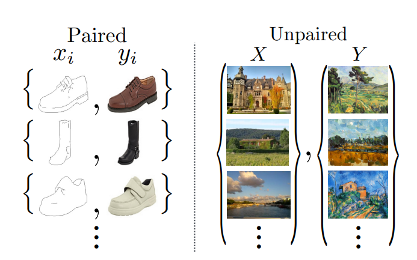
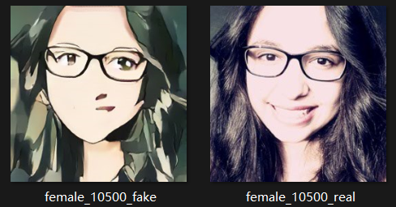

# 1.CycleGAN介绍

* CycleGAN，即循环生成对抗网络，出自发表于 ICCV17 的论文《Unpaired Image-to-Image Translation using Cycle-Consistent Adversarial Networks》，和它的兄长Pix2Pix一样，用于图像风格迁移任务。以前的GAN都是单向生成，CycleGAN为了突破Pix2Pix对数据集图片一一对应的限制，采用了双向循环生成的结构，因此得名CycleGAN。
* CycleGAN的一个重要应用领域是Domain Adaptation（域迁移：可以通俗的理解为画风迁移），比如可以把一张普通的风景照变化成梵高化作，或者将游戏画面变化成真实世界画面等等。以下是一些应用：
  
  
  
  
  
* CycleGAN的优势：其实在CycleGAN之前，就已经有了Domain Adaptation模型，比如Pix2Pix（原文链接：[https://**arxiv.org/abs/1611.0700**4](https://link.zhihu.com/?target=https%3A//arxiv.org/abs/1611.07004)），不过Pix2Pix要求训练数据必须是成对的，而现实生活中，要找到两个域(画风)中成对出现的图片是相当困难的，总不能让大师照着照片给模型画训练集吧～！因此CycleGAN诞生了，它只需要两种域的数据，而不需要他们有严格对应关系，这使得CycleGAN的应用更为广泛。关于成对数据，原论文中是这样解释的：
  
  

# 2.CycleGAN网络架构

* 下文的介绍中会用：1.real picture 2.fake picture 3.recycle picture 来代指输入的：1.真实风格图片 2.第一个生成器输出的风格迁移图片 3.第二个生成器输出的风格还原图片

## 2.1 A to B 架构

* 下图是一个由**domain A 生成 domain B**的单向循环架构


* 可以看到，CycleGAN的A2B单向架构由两个生成器 $G_{A2B}$ 和 $G_{B2A}$ 以及一个判别器 $D_{B}$ 组成
* CycleGAN中，<font color=yellow>我们不仅想要生成器 $G_{A2B}$ 产生的***fake picture in B***跟​**数据集B**​中的***real picture in B​***画风一样​，我们还希望生成器 $G_{B2A}$ 产生的***recycle picture in A***跟输入***real picture in A***内容一样</font>。这样设计网络架构可以保证***fake picture in B***相比于***real picture in A***：**<font color=red>风格迁移，内容不变</font>**（即：要求风格迁移图片还能被还原回输入图片，这样就确保了二者的内容相同，只是风格迁移）
* 输入的数据分别是:***real picture in A***输入到生成器 $G_{A2B}$ 中；***real picture in B***输入到判别器 $D_{B}$ 中
* 生成器 $G_{A2B}$ 的作用是：生成一个***domain=B***的风格迁移图片***fake picture in B***
* 生成器 $G_{B2A}$ 的作用是：输入风格迁移图片***fake picture in B***，生成风格还原图片***recycle picture in A***
* 判别器 $D_{B}$ 的作用是：输入风格迁移图片***fake picture in B***和真实图片***real picture in B***,判别二者是否风格相同（如果二者风格相似，那么应该给其打分为1；如果二者风格不相似，则打分为0）
* 在训练过程中，判别器和生成器是**分别训练**的：当我们固定住生成器的参数训练判别器时，判别器便能学到更好的判别技巧，当我们固定住判别器参数训练生成器时，生成器为了骗过现在更厉害的判别器，被迫产生出更好质量的图片。两者便在这迭代学习的过程中逐步进化，最终达到动态平衡。

## 2.2 B to A 架构

* 反向循环架构采用和2.1中相同的神经架构，由两个生成器 $G_{B2A}$ 和 $G_{A2B}$ 以及一个判别器 $D_{A}$ 组成
* 输入变为：***real picture in B***输入到生成器 $G_{B2A}$ 中；***real picture in A***输入到判别器 $D_{A}$ 中
 
## 2.3 双向循环架构

* 网络经历上述2.1和2.2两次正向传播，组合成为双向循环生成的结构，即CycleGAN名字的由来
* 网络的架构如下图（图中使用了domain X/Y替代上文domain A/B，二者本质相同）：
  
  

# 3.CycleGAN网络代码构建

## 3.1 数据输入

* 图片输入的尺寸可能是随机的，代码中使用data/unaligned_dataset.py进行输入数据整形，其中使用data/base_dataset/py中的`get_transform()`函数将图片resize成<font color=red>286 * 286 * 3</font>，再通过一个crop（裁剪）操作（no padding）将图片转换为<font color=red>256 * 286 * 3</font>，之后还有50%的可能性进行一个filp(翻转)操作。convert操作将转换后的图片数据转换为tensor变量后再进行标准化，让数据处在区间[-1,1]。

```
def get_transform(opt, params=None, grayscale=False, method=Image.BICUBIC, convert=True):
    transform_list = []
    if grayscale:
        transform_list.append(transforms.Grayscale(1))
    if 'resize' in opt.preprocess:
        osize = [opt.load_size, opt.load_size]
        transform_list.append(transforms.Resize(osize, method))
    elif 'scale_width' in opt.preprocess:
        transform_list.append(transforms.Lambda(lambda img: __scale_width(img, opt.load_size, method)))

    if 'crop' in opt.preprocess:
        if params is None:
            transform_list.append(transforms.RandomCrop(opt.crop_size))
        else:
            transform_list.append(transforms.Lambda(lambda img: __crop(img, params['crop_pos'], opt.crop_size)))

    if opt.preprocess == 'none':
        transform_list.append(transforms.Lambda(lambda img: __make_power_2(img, base=4, method=method)))

    if not opt.no_flip:
        if params is None:
            transform_list.append(transforms.RandomHorizontalFlip())
        elif params['flip']:
            transform_list.append(transforms.Lambda(lambda img: __flip(img, params['flip'])))

    if convert:
        transform_list += [transforms.ToTensor()]
        if grayscale:
            transform_list += [transforms.Normalize((0.5,), (0.5,))]
        else:
            transform_list += [transforms.Normalize((0.5, 0.5, 0.5), (0.5, 0.5, 0.5))]
    return transforms.Compose(transform_list)
```

## 3.2 构建生成器

生成器有四种可供选择，这里我们选择models/network.py中默认的`ResnetGenerator()`

1. 先使用models/network.py中`get_norm_layer()`函数，对输入的real picture数据进行归一化再输入到G与D中，有batch/instance/none三种方式可以选择，此步使用的是**batch normalization**（instance normalization指对每个通道做归一化，放在RGB图像中就是对三通道各自独自做归一化）。

```
def get_norm_layer(norm_type='instance'):
    """Return a normalization layer

    Parameters:
        norm_type (str) -- the name of the normalization layer: batch | instance | none

    For BatchNorm, we use learnable affine parameters and track running statistics (mean/stddev).
    For InstanceNorm, we do not use learnable affine parameters. We do not track running statistics.
    """
    if norm_type == 'batch':
        norm_layer = functools.partial(nn.BatchNorm2d, affine=True, track_running_stats=True)
    elif norm_type == 'instance':
        norm_layer = functools.partial(nn.InstanceNorm2d, affine=False, track_running_stats=False)
    elif norm_type == 'none':
        norm_layer = lambda x: Identity()
    else:
        raise NotImplementedError('normalization layer [%s] is not found' % norm_type)
    return norm_layer
```

2. 先进行一次<font color=red>**same卷积**</font>，分为padding(3)->same卷积(k=7,s=1,filter数量=64)->instance normalization->通过relu激活函数. 此时输入数据shape由<font color=red>256✖256✖3变为256✖256✖64</font>（{256+2✖3-7}/1+1=256，故为same卷积）
   
3. 进行<font color=red>**两次下采样卷积**</font>：（padding(1)->下采样卷积(k=3,s=2)->instance normalization->通过relu激活函数）✖2。经历两次下采样卷积以后图片shape变化为<font color=red>256✖256✖64->128✖128✖128->64✖64✖256</font>，通过不断控制卷积过程中的filter数量来让原始256✖256✖3的输入数据变为256个shape=64✖64的特征图
   
4. 进行<font color=red>**9(由参数n_bolcks控制)次same卷积**</font>，并在9次卷积中加入残差操作
   
5. 进行<font color=red>**两次上采样卷积**</font>：padding(1)->上采样卷积(k=3,s=2)->instance normalization->通过relu激活函数）✖2。经历两次上采样卷积以后图片shape变化为<font color=red>64✖64✖256->128✖128✖128->256✖256✖64</font>。
   
6. 进行<font color=red>**最后一次same卷积**</font>，分为：padding(3)->same卷积(k=7,s=1,filter数量=3)->instance normalization->通过relu激活函数。需要注意的是，代码中通过<font color=red>参数output_nc</font>来控制此次filter的数量，为了让生成器最终同样输出一个与输入的real picture形状相同的风格迁移图像fake picture，故参数output_nc应等于3。因此，最终此次卷积输出数据shape=<font color=red>256✖256✖3</font>

7. 通过<font color=red>**一次tanh激活函数**</font>，得到最终生成器的输出

以下是函数`ResnetGenerator()`：

```
class ResnetGenerator(nn.Module):
    """Resnet-based generator that consists of Resnet blocks between a few downsampling/upsampling operations.

    We adapt Torch code and idea from Justin Johnson's neural style transfer project(https://github.com/jcjohnson/fast-neural-style)
    """

    def __init__(self, input_nc, output_nc, ngf=64, norm_layer=nn.BatchNorm2d, use_dropout=False, n_blocks=6, padding_type='reflect'):
        """Construct a Resnet-based generator

        Parameters:
            input_nc (int)      -- the number of channels in input images
            output_nc (int)     -- the number of channels in output images
            ngf (int)           -- the number of filters in the last conv layer
            norm_layer          -- normalization layer
            use_dropout (bool)  -- if use dropout layers
            n_blocks (int)      -- the number of ResNet blocks
            padding_type (str)  -- the name of padding layer in conv layers: reflect | replicate | zero
        """
        assert(n_blocks >= 0)
        super(ResnetGenerator, self).__init__()
        if type(norm_layer) == functools.partial:
            use_bias = norm_layer.func == nn.InstanceNorm2d
        else:
            use_bias = norm_layer == nn.InstanceNorm2d

        model = [nn.ReflectionPad2d(3),
                 nn.Conv2d(input_nc, ngf, kernel_size=7, padding=0, bias=use_bias),
                 norm_layer(ngf),
                 nn.ReLU(True)]

        n_downsampling = 2
        for i in range(n_downsampling):  # add downsampling layers
            mult = 2 ** i
            model += [nn.Conv2d(ngf * mult, ngf * mult * 2, kernel_size=3, stride=2, padding=1, bias=use_bias),
                      norm_layer(ngf * mult * 2),
                      nn.ReLU(True)]

        mult = 2 ** n_downsampling
        for i in range(n_blocks):       # add ResNet blocks

            model += [ResnetBlock(ngf * mult, padding_type=padding_type, norm_layer=norm_layer, use_dropout=use_dropout, use_bias=use_bias)]
        print (model)
        for i in range(n_downsampling):  # add upsampling layers
            mult = 2 ** (n_downsampling - i)
            model += [nn.ConvTranspose2d(ngf * mult, int(ngf * mult / 2),
                                         kernel_size=3, stride=2,
                                         padding=1, output_padding=1,
                                         bias=use_bias),
                      norm_layer(int(ngf * mult / 2)),
                      nn.ReLU(True)]
        model += [nn.ReflectionPad2d(3)]
        model += [nn.Conv2d(ngf, output_nc, kernel_size=7, padding=0)]
        model += [nn.Tanh()]
        print (model)
        self.model = nn.Sequential(*model)

    def forward(self, input):
        """Standard forward"""
        return self.model(input)
```

## 3.3 构建判别器

判别器有三个类别可以选择，一般我们选择basic类别，即：默认的**patchGAN discriminator**，通过models/network.py中的`NLayerDiscriminator()`函数实现，下面讲解的判别器架构也是patchGAN discriminator。

patchGAN discriminator不同于GAN中discriminator，其所得结果是一个<font color=red> $N\times{N}$ </font>的prediction矩阵，这个矩阵中每个元素代表了原图片中的一块区域，即一个<font color=red>Patch(感受野)</font>，然后基于这个矩阵，用损失函数来判断是否针对每个patch都判断正确。由于其输出为shape=<font color=red>$N\times{N}$</font>的prediction矩阵,所以与其一共输入损失函数的标签也应该是一个shape=<font color=red> $N\times{N}$ </font>的label矩阵,根据不同损失函数的需求，此label矩阵中所有元素应该为**valid(1)或fake(0)**

1. 先进行<font color=red>**一次下采样卷积**</font>：padding(1)->same卷积(k=4,s=2,filter数量=64)->通过leaky_relu激活函数,此时输入的风格迁移后图片fake picture和真实图片real picture数据,shape由<font color=red>256✖256✖3变为128✖128✖64</font>（{256+2✖1-4}/2+1=128）
2. 再进行<font color=red>**四次下采样卷积**</font>：（padding(1)->same卷积(k=4,s=2)->instance normalization->通过leaky_relu激活函数）✖4,经历三次下采样卷积以后图片shape变化为<font color=red>128✖128✖64->64✖64✖128->32✖32✖256->16✖16✖512->8✖8✖384</font>，通过不断控制卷积过程中的filter数量来让原始128✖128✖64的输入数据变为384个shape=8✖8的特征图
3. 再进行一次<font color=red>**最后一次卷积操作**</font>：所以，此次卷积分为：padding(1)->卷积(k=4,s=1,filter数量=1)->instance normalization->通过leaky_relu激活函数。需要注意的是，代码中通过控制此次filter的数量，让生成器最终输出一个<font color=red>4✖4✖1</font>的prediction矩阵（{8+2✖1-4}/2+1=4）

以下是`NLayerDiscriminator()`函数

```
class NLayerDiscriminator(nn.Module):
    """Defines a PatchGAN discriminator"""

    def __init__(self, input_nc, ndf=64, n_layers=3, norm_layer=nn.BatchNorm2d):
        """Construct a PatchGAN discriminator

        Parameters:
            input_nc (int)  -- the number of channels in input images
            ndf (int)       -- the number of filters in the last conv layer
            n_layers (int)  -- the number of conv layers in the discriminator
            norm_layer      -- normalization layer
        """
        super(NLayerDiscriminator, self).__init__()
        if type(norm_layer) == functools.partial:  # no need to use bias as BatchNorm2d has affine parameters
            use_bias = norm_layer.func == nn.InstanceNorm2d
        else:
            use_bias = norm_layer == nn.InstanceNorm2d

        kw = 4
        padw = 1
        sequence = [nn.Conv2d(input_nc, ndf, kernel_size=kw, stride=2, padding=padw), nn.LeakyReLU(0.2, True)]
        nf_mult = 1
        nf_mult_prev = 1
        for n in range(1, n_layers):  # gradually increase the number of filters
            nf_mult_prev = nf_mult
            nf_mult = min(2 ** n, 8)
            sequence += [
                nn.Conv2d(ndf * nf_mult_prev, ndf * nf_mult, kernel_size=kw, stride=2, padding=padw, bias=use_bias),
                norm_layer(ndf * nf_mult),
                nn.LeakyReLU(0.2, True)
            ]

        nf_mult_prev = nf_mult
        nf_mult = min(2 ** n_layers, 8)
        sequence += [
            nn.Conv2d(ndf * nf_mult_prev, ndf * nf_mult, kernel_size=kw, stride=1, padding=padw, bias=use_bias),
            norm_layer(ndf * nf_mult),
            nn.LeakyReLU(0.2, True)
        ]

        sequence += [nn.Conv2d(ndf * nf_mult, 1, kernel_size=kw, stride=1, padding=padw)]  # output 1 channel prediction map
        self.model = nn.Sequential(*sequence)

    def forward(self, input):
        """Standard forward."""
        return self.model(input)
```

## 3.4 损失函数

### 3.4.1 总体介绍

* CycleGAN的Loss由两部分组成
  
  

其中：

1. $Loss_{GAN}$保证生成器和判别器相互进化，进而保证生成器能产生更真实的图片。其有两种版本可供选择，分别是`MSEloss`均方误差损失函数和`BCEWithLogitsLoss()`二分类损失函数，下面采用`BCEWithLogitsLoss()`二分类损失函数进行展示。
2. $Loss_{Cycle}$保证生成器的输出图片与输入图片只是风格迁移，而内容相同。

* 下面分别用 $G$ 和 $F$ 代表 $G_{A2B}$ 和 $G_{A2B}$，具体的：
  
  


### 3.4.2 生成器损失函数

* 训练生成器的时候， $D_X$ 和 $D_Y$ 的参数被固定，只有 $G$ 和 $F$ 参数可调

一. $Minimize Loss_{GAN}$


1. 调整 $G$ 的参数，使得 $D_Y$ 对 $G$ 产生的图片 $G(x)$ 的打分 $D_Y(G(x))$ 越高越好
2. 调整 $F$ 的参数，使得 $D_X$ 对 $F$ 产生的图片 $F(y)$ 的打分 $D_X(F(y))$ 越高越好
3. 标签 $E_{X-P_{data}}$ 和 $E_{Y-P_{data}}$ 的设置和GAN中原理相同:由于生成器的功能是生成足够骗过判别器的风格迁移图片，所以在自身的损失函数中输入的标签应该为vaild(1)

因此如上文所述，$Minimize Loss_{GAN}$保证了生成器产生的图片越来越真实（风格越来越像另一个种类的图片）

二. $Minimize Loss_{Cycle}$

1. 其被设置为平均绝对误差损失函数`L1loss`，输入分别为 $F(G(x))$ 和 $G(F(y))$ ，计算二者之间各元素点的均方误差
2. 保证了生成器的输出图片与输入图片只是风格迁移，而内容相同

### 3.4.3 判别器损失函数

* 训练判别器时， $G$ 和 $F$ 参数固定， $D_X$ 和 $D_Y$ 的参数可调。此时我们不是 $Minimize Loss_{GAN}$ 而是 $Maximize Loss_{GAN}$ 。下面以：**由 $domain-{y}$ 转变为 $domain-x$ 的单向循环中，判别器 $D_X$ 对应损失函数的更新过程**为例


* 训练判别器时，应该极大化 $D_X(x)$ 的值（让判别器给输入的**real picture in Y**判高分）
* 同时,应该极小化 $D_X(F(y))$ 的值（让判别器给生成的**fake picture in X**判低分）

### 3.4.4 特殊的 $Loss_Idt$ :Identity Loss

* Identity Loss的作用主要是保证**色调**不变。Identity Loss的形式为：


即：在双向生成结构中让生成器输出的风格迁移图片fake picture in X/Y再次输入到所在方向对应的生成器中，将输出与fake picture in X/Y本身做带标签的`L1loss`计算，以得出 $Loss_Idt$

* 加上Identity Loss后，整个损失函数的表达式为：


* 下图很好的展示了CycleGAN中的Loss构成：


# 4.基于CycleGAN的”人脸2动漫“风格转换

## 4.1 selfie2anime数据集（需解压在datasets文件夹中）

* 数据集背景：

1. 对于selfie 数据集，包含46,836张自拍照，带有36个不同的属性。U-GAT-IT论文只使用女性的照片作为训练数据和测试数据。训练数据集的大小为3400，测试数据集的大小为100，图像大小为256×256。
   
2. 对于 anime 数据集，作者首先通过 Anime-Planet (http://www.anime-planet.com/) 中检索了69926张动漫人物图像。在这些图像中，使用 anime-face detector (https://github.com/nagadomi/lbpcascade animeface) 提取了27,023张人脸图像。在只选择女性图像和手动去除单色图像后，一共收集了2个女性动漫人脸图像数据集，训练集和测试机的大小分别为3400和100，与selfie数据集相同。
   
3. 最后，通过使用基于CNN的图像超分辨率算法(https://github.com/nagadomi/waifu2x)，将所有动漫人脸图像的大小调整为256 x 256。

* 数据集内容：

1. trainA：真实自拍图像（源域），3400张，训练集
   
2. trainB：动漫人脸图像（目标域），3400张，训练集
   
3. testA：真实自拍图像，100张，测试集
   
4. testB：动漫人脸图像，100张，测试集

* 数据集来源：

1. 下载链接：https://drive.google.com/file/d/1xOWj1UVgp6NKMT3HbPhBbtq2A4EDkghF/view
   
2. 官方公布链接：https://github.com/taki0112/UGATIT

* 数据集解压后效果应为：
  
  


## 4.2 参数配置

### 4.2.1 train.py参数配置

* 在train.py的Edit Configurations中的Scripts paramters中添加如下配置：
  --dataroot ./datasets/selfie2anime
  --name selfie2anime.pth_pretrained
  --model cycle_gan

### 4.2.2 test.py参数配置

* 在test.py的Edit Configurations中的Scripts paramters中添加如下配置：
  --dataroot ./datasets/selfie2anime/testA
  --name selfie2anime.pth_pretrained
  --model test --no_dropout

### 4.2.3 训练所用超参数展示

* 由于硬件设备的限制，本项目只训练了40轮，其中前20轮学习率不变，后20轮学习率衰减，可以在运行界面中查看学习率衰减的情况
* 前20轮
  
  

* 后20轮
  
  

以下是训练所用超参数展示

```
----------------- Options ---------------
               batch_size: 1                             
                    beta1: 0.5                           
          checkpoints_dir: ./checkpoints                 
           continue_train: False                         
                crop_size: 256                           
                 dataroot: ./datasets/selfie2anime       	[default: None]
             dataset_mode: unaligned                     
                direction: AtoB                          
              display_env: main                          
             display_freq: 400                           
               display_id: 1                             
            display_ncols: 4                             
             display_port: 8097                          
           display_server: http://localhost              
          display_winsize: 256                           
                    epoch: latest                        
              epoch_count: 1                             
                 gan_mode: lsgan                         
                  gpu_ids: 0                             
                init_gain: 0.02                          
                init_type: normal                        
                 input_nc: 3                             
                  isTrain: True                          	[default: None]
                 lambda_A: 10.0                          
                 lambda_B: 10.0                          
          lambda_identity: 0.5                           
                load_iter: 0                             	[default: 0]
                load_size: 286                           
                       lr: 0.0002                        
           lr_decay_iters: 50                            
                lr_policy: linear                        
         max_dataset_size: inf                           
                    model: cycle_gan                     
               n_layers_D: 3                             
                     name: selfie2anime.pth_pretrained   	[default: experiment_name]
                      ndf: 64                            
                     netD: basic                         
                     netG: resnet_9blocks                
                      ngf: 64                            
                    niter: 20                            
              niter_decay: 20                            
               no_dropout: True                          
                  no_flip: False                         
                  no_html: False                         
                     norm: instance                      
              num_threads: 4                             
                output_nc: 3                             
                    phase: train                         
                pool_size: 50                            
               preprocess: resize_and_crop               
               print_freq: 100                           
             save_by_iter: False                         
          save_epoch_freq: 5                             
         save_latest_freq: 5000                          
           serial_batches: False                         
                   suffix:                               
         update_html_freq: 1000                          
                  verbose: False                         
----------------- End -------------------
```

## 4.3 结果展示

* 训练结束后，最后一轮训练所得出的权重会被存储至checkpoints/selfie2anime.pth_pretrained，如下：
  
  

* 由于我们训练的风格转换方向是AtoB,所以使用latest_net_G_A.pth来作为检测集所使用的权重文件，将latest_net_G_A.pth重命名为latest_net_G.pth以方便test.py找到它
* 运行test.py函数，检测风格转换的精准度，所得到的对比图片会被存储到results/selfie2anime.pth_pretrained/test_latest/images中。下面是几组对比结果：
  
  1. 由于训练次数较少，大多数对比组会出现比较悲催的风格转换结果……，例如：
     
     
     
  2. 但出人意料的是，依旧有几组对照组呈现出了较好的转换效果：
     
     
     
     
     
     
     
     

